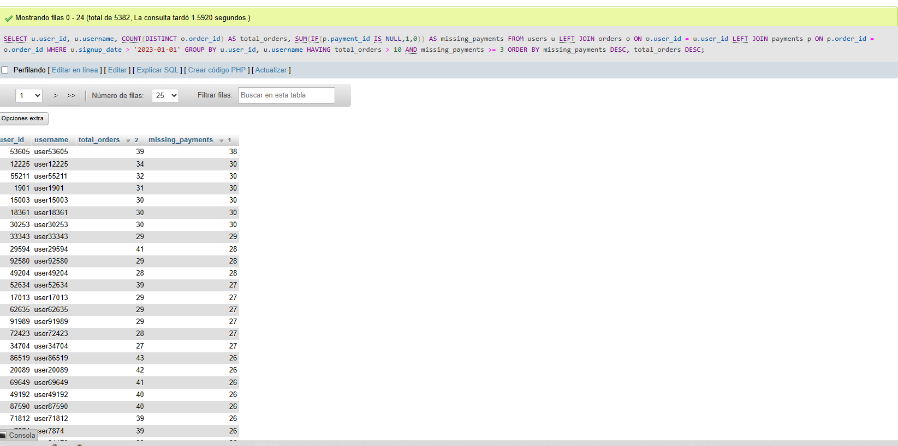
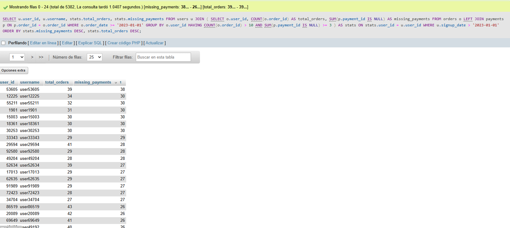

# 2. Query monstruo #2 — buscar usuarios “sospechosos” con muchos pedidos y pagos faltantes

```sql
SELECT u.user_id, u.username, COUNT(DISTINCT o.order_id) AS total_orders,
       SUM(IF(p.payment_id IS NULL,1,0)) AS missing_payments
FROM users u
LEFT JOIN orders o ON o.user_id = u.user_id
LEFT JOIN payments p ON p.order_id = o.order_id
WHERE u.signup_date > '2023-01-01'
GROUP BY u.user_id, u.username
HAVING total_orders > 10 AND missing_payments >= 3
ORDER BY missing_payments DESC, total_orders DESC;
```

Problemas intencionales:

* LEFT JOIN que obliga a recorrer todas las órdenes y pagos incluso si no son relevantes.
* COUNT(DISTINCT o.order\_id) es costoso en bases grandes.
* SUM(IF(...)) sobre LEFT JOIN → función calculada row by row, muy lenta.
* HAVING sobre agregados grandes.
* Falta de filtros tempranos: u.signup\_date se aplica después de los JOINs si no se reordena.

### EXPLAIN simulado

id | table | type | rows     | Extra
--- |------------- |--------- |---------- |----------------------------------------
1  | u     | ref  | 500000   | Using where
1  | o     | ref  | 2000000  | Using join buffer
1  | p     | ref  | 1800000  | Using where

Comentarios:

* `rows` gigantes → problema de JOIN inicial sin filtrado.
* `Using join buffer` indica que MySQL está usando buffer para LEFT JOINs con grandes volúmenes.
* HAVING sobre agregados grandes provoca temporary tables y filesort.

### Reescritura optimizada

```sql
SELECT 
    u.user_id,
    u.username,
    stats.total_orders,
    stats.missing_payments
FROM users u
JOIN (
    SELECT 
        o.user_id,
        COUNT(o.order_id) AS total_orders,
        SUM(p.payment_id IS NULL) AS missing_payments
    FROM orders o
    LEFT JOIN payments p 
        ON p.order_id = o.order_id
    WHERE o.order_date >= '2023-01-01'
    GROUP BY o.user_id
    HAVING COUNT(o.order_id) > 10
       AND SUM(p.payment_id IS NULL) >= 3
) AS stats
    ON stats.user_id = u.user_id
WHERE u.signup_date > '2023-01-01'
ORDER BY stats.missing_payments DESC,
         stats.total_orders DESC;
```

Objetivos:

1. Aplicar ​**filtros antes del JOIN**​.
2. Evitar `COUNT(DISTINCT)` innecesario si podemos asegurar unicidad.
3. Reemplazar `SUM(IF(...))` por `COUNT()` condicional dentro de la agregación optimizada.

Mejoras:

1. Procesas orders y payments **sin users** : Orders es la tabla más grande → procesarla sola reduce uniones costosas.
2. La subconsulta devuelve **una fila por usuario**: MySQL une users con ​**1000–3000 filas**​, no con millones de orders.
3. Eliminamos DISTINCT: Ya no hace falta.
4. SUM(p.payment_id IS NULL) es más rápido que COUNT: Menos trabajo en el GROUP BY.
5. El HAVING se aplica **antes del JOIN final**:  Filtramos usuarios que no cumplen, reduciendo más aún la cardinalidad.

### Capturas





