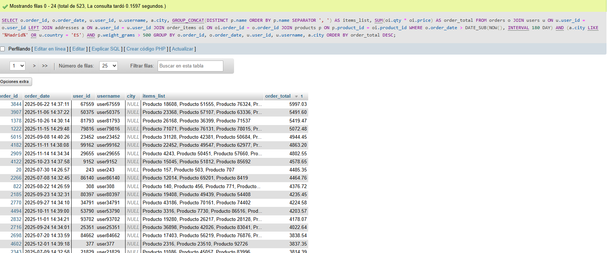
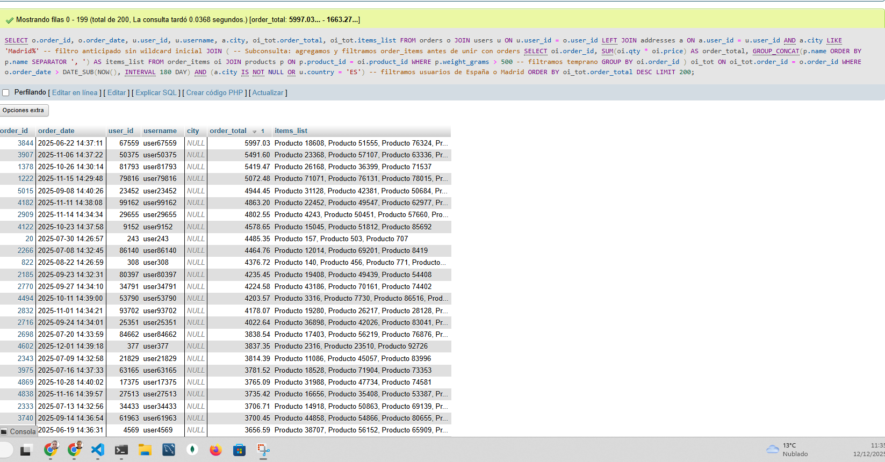

### Reescritura optimizada## 3. Query monstruo #3 — join ancho entre orders, items, products y addresses con filtros múltiples

```sql
SELECT
    o.order_id,
    o.order_date,
    u.user_id,
    u.username,
    a.city,
    GROUP_CONCAT(DISTINCT p.name ORDER BY p.name SEPARATOR ', ') AS items_list,
    SUM(oi.qty * oi.price) AS order_total
FROM orders o
JOIN users u ON u.user_id = o.user_id
LEFT JOIN addresses a ON a.user_id = u.user_id
JOIN order_items oi ON oi.order_id = o.order_id
JOIN products p ON p.product_id = oi.product_id
WHERE o.order_date > DATE_SUB(NOW(), INTERVAL 180 DAY)
  AND (a.city LIKE '%Madrid%' OR u.country = 'ES')
  AND p.weight_grams > 500
GROUP BY o.order_id, o.order_date, u.user_id, u.username, a.city
ORDER BY order_total DESC
LIMIT 200;
```

Problemas intencionales:

* JOIN ancho con varias tablas que puede crecer exponencialmente.
* Funciones sobre columnas y wildcard inicial en LIKE (`%Madrid%`) impiden uso de índices.
* GROUP\_CONCAT con DISTINCT sobre dataset grande → costoso en memoria.
* Filtros aplicados tarde: `p.weight_grams` después del JOIN, `a.city` con wildcard.
* ORDER BY sobre agregado calculado (`order_total`) → uso de temporary tables.

### EXPLAIN simulado

id | table | type | rows     | Extra
--- |------------- |--------- |---------- |----------------------------------------
1  | o     | range| 500000   | Using where
1  | u     | eq_ref| 1       | 
1  | a     | ref  | 200000   | Using where
1  | oi    | ref  | 1000000  | 
1  | p     | ref  | 500000   | Using where; Using join buffer

Comentarios:

* `rows` enormes en `oi` y `p` → JOIN amplio antes de filtrado.
* `Using join buffer` indica que MySQL tiene que almacenar temporalmente resultados de JOIN pesado.
* GROUP\_CONCAT y SUM sobre millones de filas provocan `Using temporary` y `filesort`.

### Reescritura optimizada

```sql
SELECT 
    o.order_id,
    o.order_date,
    u.user_id,
    u.username,
    a.city,
    oi_tot.order_total,
    oi_tot.items_list
FROM orders o
JOIN users u 
    ON u.user_id = o.user_id
LEFT JOIN addresses a 
    ON a.user_id = u.user_id
    AND a.city LIKE 'Madrid%'  -- filtro anticipado sin wildcard inicial
JOIN (
    -- Subconsulta: agregamos y filtramos order_items antes de unir con orders
    SELECT 
        oi.order_id,
        SUM(oi.qty * oi.price) AS order_total,
        GROUP_CONCAT(p.name ORDER BY p.name SEPARATOR ', ') AS items_list
    FROM order_items oi
    JOIN products p 
        ON p.product_id = oi.product_id
    WHERE p.weight_grams > 500  -- filtramos temprano
    GROUP BY oi.order_id
) oi_tot
    ON oi_tot.order_id = o.order_id
WHERE o.order_date > DATE_SUB(NOW(), INTERVAL 180 DAY)
  AND (a.city IS NOT NULL OR u.country = 'ES')  -- filtramos usuarios de España o Madrid
ORDER BY oi_tot.order_total DESC
LIMIT 200;
```

Objetivos:

* Filtrar **antes de unir** tablas grandes.
* Evitar wildcard inicial en LIKE para permitir índice.
* Reducir cardinalidad antes de GROUP BY.
* Aplicar agregaciones en subconsulta si es necesario.

Mejoras:

* **Filtrado previo**
  * `p.weight_grams > 500` se aplica **antes de agrupar** en la subconsulta.
  * `a.city LIKE 'Madrid%'` se aplica dentro del LEFT JOIN para no unir direcciones irrelevantes.
* **Reducción de cardinalidad**
  * La subconsulta `oi_tot` calcula `SUM` y `GROUP_CONCAT` solo sobre `order_items` relevantes, evitando que todas las filas de `order_items` lleguen a la unión con `orders`.
* **Filtrado eficiente de usuarios**
  * La condición `(a.city IS NOT NULL OR u.country = 'ES')` mantiene solo los pedidos de usuarios españoles o residentes en Madrid.
* **GROUP\_CONCAT y SUM limitados**
  * Solo se agrupan los `order_items` que cumplen `p.weight_grams > 500`. Esto reduce uso de memoria y tiempo de cálculo.
* **ORDER BY manejable**
  * Se ordena solo sobre el conjunto reducido de 180 días y items filtrados.

### Capturas





