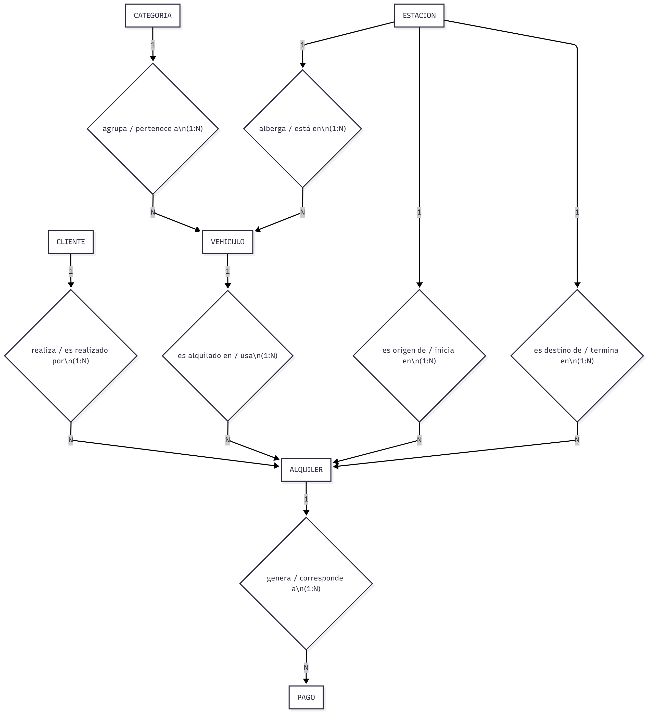

# Parcial 1:

## ejercicio 1:

### Entidades y atributos

* Cliente (`id_cliente`) : id_cliente, nombre, documento, telefono, email, fecha_registro
* Vehículo (`id_vehiculo`) : id_vehiculo, matricula, modelo, estado, autonomia
* Categoría(`id_categoria`) : id_categoria, nombre_categoria, descripcion
* Estación (`id_estacion`) : id_estacion, nombre_estacion, zona, capacidad, direccion
* Alquiler (`id_alquiler`) : id_alquiler, fecha_inicio, fecha_fin, costo, estado
* Pago (`id_pago`) : id_pago, fecha\_pago, monto, metodo_pago

### Relaciones

* **Cliente — Alquila — Alquiler**
  
  * Cliente **realiza** Alquiler (1:N desde Cliente → Alquiler)
  * Alquiler **es realizado por** Cliente (N:1 desde Alquiler → Cliente)
* **Vehículo — ParticipaEn — Alquiler**
  
  * Vehículo **puede ser alquilado en** Alquiler (1:N desde Vehículo → Alquiler) — un vehículo puede tener muchos alquileres a lo largo del tiempo; en un momento dado solo 0..1 alquiler activo.
  * Alquiler **usa** Vehículo (N:1 desde Alquiler → Vehículo)
* **Categoría — Agrupa — Vehículo**
  
  * Categoría **agrupa** Vehículo (1:N categoría→vehículo)
  * Vehículo **pertenece a** Categoría (N:1 vehículo→categoría)
* **Estación — Ubica — Vehículo**
  
  * Estación **alberga** Vehículo (1:N estación→vehículo)
  * Vehículo **está en** Estación (N:1 vehículo→estación)
* **Estación — es origen para— Alquiler**
  
  * Estación **es origen de** Alquiler(1:N estación→vehículo)
  * Alquiler **inicia en** Estación (N:1 vehículo→estación)
* **Estación — es destino de— Alquiler**
  
  * Estación **es destino para** Alquiler(1:N estación→vehículo)
  * Alquiler **termina en** Estación (N:1 vehículo→estación)
* **Alquiler — TienePago — Pago**
  
  * Alquiler **genera** Pago (1:N alquiler→pago)
  * Pago **corresponde a** Alquiler (N:1 pago→alquiler)
  
  

---

## ejercicio 2:

**B1 := π{id_cliente, categoria}((PEDIDO ⨝ DETALLE_PEDIDO)  ⨝ PRODUCTO)**

| id_cliente | categoria    |
| ----------- | ------------ |
| 1           | Electrónica |
| 1           | Hogar        |
| 2           | Hogar        |
| 3           | Electrónica |
| 1           | Hogar        |
| 4           | Electrónica |

**B4_ELECT := π{id_cliente}(σ{categoria='Electrónica'}(B3))** — clientes que compraron Electrónica:

| id_cliente |
| ----------- |
| 1           |
| 3           |
| 4           |

**B4_HOGAR := π{id_cliente}(σ{categoria='Hogar'}(B3))** — clientes que compraron Hogar:

| id_cliente |
| ----------- |
| 1           |
| 2           |

**B5 := B4_ELECT ∩ B4_HOGAR** — intersección: clientes que compraron en ambas* categorías:

| id\_cliente |
| ----------- |
| 1           |

**B6 :=  π{nombre}(B5 ⨝ CLIENTE)** — unir con CLIENTE para obtener nombre:

| nombre |
| ------ |
| Ana    |

---

## ejercicio 3:

**DDL (CREATE TABLE) — modelo relacional sencillo (MySQL syntax, InnoDB)**

```sql
CREATE TABLE categoria (
id_categoria INT PRIMARY KEY,
nombre VARCHAR(50) NOT NULL
) ENGINE=InnoDB;

CREATE TABLE curso (
id_curso INT PRIMARY KEY,
nombre VARCHAR(100),
id_categoria INT,
FOREIGN KEY (id_categoria) REFERENCES categoria(id_categoria)
) ENGINE=InnoDB;

CREATE TABLE estudiante (
id_estudiante INT PRIMARY KEY,
nombre VARCHAR(100)
) ENGINE=InnoDB;

CREATE TABLE inscripcion (
id_curso INT,
id_estudiante INT,
fecha_inscripcion DATE,
PRIMARY KEY (id_curso, id_estudiante),
FOREIGN KEY (id_curso) REFERENCES curso(id_curso)
FOREIGN KEY (id_estudiante) REFERENCES estudiante(id_estudiante)
) ENGINE=InnoDB;

CREATE TABLE inscripcion (
id_inscripcion  INT PRIMARY KEY,
id_curso INT,
id_estudiante INT,
fecha_inscripcion DATE,
FOREIGN KEY (id_curso) REFERENCES curso(id_curso),
FOREIGN KEY (id_estudiante) REFERENCES estudiante(id_estudiante)
) ENGINE=InnoDB;
```

**Consulta solicitada (join de 3 tablas, COUNT, GROUP BY, WHERE / HAVING)**

```sql
SELECT
c.nombre AS curso,
cat.nombre AS categoria,
COUNT(i.id_estudiante) AS total_estudiantes
FROM curso c
JOIN categoria cat
ON c.id_categoria = cat.id_categoria
JOIN inscripcion i
ON c.id_curso = i.id_curso
GROUP BY c.id_curso
HAVING COUNT(i.id_estudiante) >= 2
ORDER BY total_estudiantes DESC;
```

**Resultado esperado con los datos proporcionados:**

Datos de entrada (resumen):

* CATEGORIA: (1, Programación), (2, Diseño)
* CURSO: (10, Python Básico, 1), (11, Diseño Gráfico, 2), (12, SQL Intermedio, 1)
* ESTUDIANTE: (100, Laura), (101, Pedro), (102, Sofía)
* INSCRIPCION: (10,100), (10,101), (11,102), (12,100)

Conteos por curso:

* Curso 10 (Python Básico): 2 inscritos (100,101)
* Curso 11 (Diseño Gráfico): 1 inscrito (102)
* Curso 12 (SQL Intermedio): 1 inscrito (100)

Aplicando HAVING >= 2, solo queda:

| curso          | categoria     | total\_estudiantes |
| -------------- | ------------- | ------------------ |
| Python Básico | Programación | 2                  |

---

## ejercicio 4:

**En un modelo entidad-relación (E/R), ¿qué representa una entidad?**

a) Una relación entre dos tablas

~~**b) Un objeto o cosa del mundo real que tiene existencia propia y se describe con atributos**~~

c) Una clave primaria que identifica registros

d) Una fila dentro de una tabla

**En un diagrama conceptual, las relaciones entre entidades se representan mediante:**

a) Rectángulos

b) Óvalos

~~**c) Rombos**~~

d) Llaves

**¿Cuál de las siguientes afirmaciones describe mejor la cardinalidad 1:N?**

a) Cada instancia de una entidad A se asocia con exactamente una instancia de B, y viceversa

~~**b) Cada instancia de A puede estar asociada con muchas instancias de B, pero cada B pertenece solo a una A**~~

c) Varias instancias de A pueden asociarse con varias instancias de B

d) A y B no tienen relación directa

**¿Qué diferencia principal existe entre el modelo conceptual y el modelo físico?**

a) El modelo conceptual usa SQL y el físico usa diagramas

~~**b) El modelo conceptual describe el problema del mundo real, el físico define cómo se implementa en la base de datos**~~

c) El modelo físico no usa claves primarias

d) Ambos son idénticos, solo cambian los nombres de los atributos

**Una clave primaria (PK) sirve para:**

a) Permitir duplicados en una tabla

b) Enlazar una tabla con otra sin restricciones

~~**c) Identificar de manera única cada fila dentro de una tabla**~~

d) Generar índices automáticamente

**En el modelo relacional, una clave foránea (FK):**

a) Es una columna que se repite dentro de la misma tabla

~~**b) Enlaza una tabla con otra mediante la referencia a la clave primaria de la segunda**~~

c) Es una columna que nunca puede ser nula

d) Se usa solo en vistas

**El paso de un modelo conceptual a un modelo relacional implica:**

~~**a) Convertir entidades en tablas y relaciones en claves foráneas**~~

b) Agrupar todas las entidades en una sola tabla

c) Reescribir atributos como registros

d) Eliminar las claves primarias

**En un modelo E/R, la cardinalidad 0..1 a N indica que:**

~~**a) Una entidad puede estar relacionada con ninguna o una instancia de la otra, mientras que la otra puede tener muchas instancias relacionadas**~~

b) Ambas entidades deben tener siempre al menos una instancia relacionada

c) Es equivalente a una relación 1:1

d) No se permite la relación múltiple

